**LAPORAN PRAKTIKUM REKAYASA PERANGKAT LUNAK**

**GABUNGAN SEMUA MODUL** 

**Dosen Pengampu:**

Dr. Agung Teguh Wibowo Almais, S.Kom, M.T 
**\

**Oleh :**

Muhammad Nailul Ghufron Majid

(240605110160) 

Ghofran (240605110013)

**PRODI TEKNIK INFORMATIKA** 

**FAKULTAS SAINS DAN TEKNOLOGI** 

**UNIVERSITAS ISLAM NEGERI MAULANA MALIK IBRAHIM**  

**MALANG** 

**2026** 

# **Modul 1**
**a. Judul Perangkat Lunak: Laundry Management System (LMS)** - Sistem Manajemen Operasional Toko Laundry Berbasis Web.

**b. Permasalahan** Berdasarkan hasil observasi dan wawancara, kendala yang dihadapi oleh usaha laundry (contohnya: Toko LaundryYok) meliputi:

- **Sistem masih berjalan secara manual**, baik dalam pencatatan transaksi maupun pembuatan laporan.
- Tingginya **risiko kehilangan nota** transaksi dan rentan terjadi **kesalahan perhitungan** pembayaran.
- Kurangnya transparansi pada alur operasional, yang berpotensi menyebabkan **keterlambatan penyelesaian dan kesalahan pelabelan cucian**.
- Pemilik (*Owner*) kesulitan memantau laporan pendapatan harian dan mengevaluasi kinerja secara langsung dan cepat.

**c. Solusi** Solusi yang ditawarkan adalah **mengotomatisasi proses bisnis melalui platform digital terintegrasi**. Solusi ini mencakup:

- Menggunakan basis data terpusat untuk menyimpan data pelanggan, mencatat transaksi, dan menghitung pembayaran secara otomatis dengan validasi sistem guna menekan angka kesalahan.
- Menerapkan **fitur *monitoring* status cucian** agar progres pekerjaan dapat dilacak secara *real-time*.
- Menyediakan *dashboard* laporan instan untuk memudahkan manajemen dalam evaluasi kinerja dan akses data keuangan.

**d. Perangkat Lunak yang Akan Dibuat** Perangkat lunak yang akan dikembangkan adalah **Sistem Manajemen Operasional Toko Laundry Berbasis Web**. Sistem ini akan dilengkapi dengan berbagai fitur utama, antara lain:

- Manajemen data pelanggan dan transaksi.
- Pemantauan alur operasional / status cucian (*real-time*).
- Sistem keamanan data dengan pembagian hak akses pengguna (*user roles*).
- *Dashboard* rekapitulasi laporan pendapatan (harian, mingguan, dan bulanan).
- Sistem notifikasi.

**e. Target Market atau Pengguna** Target pasar perangkat lunak ini adalah bisnis **Toko Laundry (seperti contohnya Toko LaundryYok)**. Adapun target pengguna (*user*) di dalam sistem ini meliputi struktur organisasi perusahaan tersebut, yaitu:

- ***Owner* (Pemilik Laundry)**
- **Manajer Operasional**
- ***Admin*/Kasir**
- **Petugas Produksi** (Petugas Pencucian dan Petugas Setrika & *Packing*)
# **Modul 2**
## **a. Judul Perangkat Lunak dan Metodologi Pengembangan Sistem**
**Judul:** Laundry Management System (LMS) - Sistem Manajemen Operasional Toko Laundry Berbasis Web.

**Metodologi:** Waterfall (Model Linear Terstruktur).

**Alasan Pemilihan Metodologi:** 1. **Requirement Terdefinisi:** Alur bisnis laundry (penerimaan, pencucian, setrika, pengambilan) bersifat sekuensial dan stabil. 2. **Skala UMKM:** Sangat efektif untuk sistem manajemen skala kecil hingga menengah (1 toko dengan 1-2 cabang kecil) agar biaya pengembangan terkontrol. 3. **Dokumentasi Terstruktur:** Memudahkan sinkronisasi data operasional antara admin dan pemilik secara bertahap sesuai standar akademik.
## **b. Kondisi Awal Kasus (Analisis Masalah Umum Laundry)**
Berdasarkan analisis terhadap kendala yang umum dihadapi oleh operasional toko laundry konvensional:

1. **Pencatatan Manual:** Mayoritas transaksi masih dicatat pada nota kertas manual, yang berisiko tinggi hilang, sobek, atau terkena air.
1. **Kesalahan Kalkulasi:** Terjadi risiko kesalahan perhitungan biaya (human error) rata-rata 5% per bulan akibat kalkulasi manual berat (kg) dikalikan tarif paket.
1. **Ketidakteraturan Status:** Antrian cucian sering tidak terorganisir dengan baik karena tidak adanya sistem monitoring status (Proses/Selesai) yang dapat dilihat secara cepat.
1. **Kehilangan Informasi Pelanggan:** Data pelanggan tidak terdata secara digital, sehingga sulit untuk melakukan pencarian riwayat transaksi atau memberikan promo loyalitas.
1. **Kesulitan Monitoring Jarak Jauh:** Pemilik toko yang memiliki lebih dari satu cabang kesulitan memantau laporan pendapatan harian tanpa harus datang langsung ke lokasi fisik.
## **c. Kebutuhan Fungsional (Functional Requirement)**
- **FR-01:** Sistem harus menyediakan fitur login dengan autentikasi untuk membatasi akses data.
- **FR-02:** Sistem harus memiliki pembagian hak akses (Owner dan Kasir/Admin).
- **FR-03:** Sistem harus mampu mencatat data transaksi masuk (pilihan paket layanan dan berat cucian).
- **FR-04:** Sistem mampu melakukan perhitungan total biaya secara otomatis berdasarkan tarif paket.
- **FR-05:** Sistem harus memiliki fitur validasi input (misal: berat cucian tidak boleh nol atau negatif).
- **FR-06:** Sistem harus mampu mengubah dan menampilkan status operasional cucian (Antre, Proses, Selesai, Diambil).
- **FR-07:** Sistem mampu menyimpan dan menampilkan database pelanggan (Nama dan Nomor Telepon).
- **FR-08:** Sistem mampu mencetak struk transaksi digital dalam format PDF.
- **FR-09:** Sistem mampu menampilkan dashboard laporan pendapatan harian, mingguan, dan bulanan untuk Owner.
- **FR-10:** Sistem harus menyediakan fitur Logout untuk keamanan akun.
## **d. Kebutuhan Non-Fungsional (Non-Functional Requirement)**
- **Security:** Implementasi enkripsi password dan proteksi login berbasis peran.
- **Performance:** Sistem harus responsif dalam memproses input transaksi dalam waktu kurang dari 5 detik.
- **Availability:** Sistem harus tersedia minimum 95% selama jam operasional toko berlangsung.
- **Accuracy:** Seluruh perhitungan aritmatika biaya transaksi harus memiliki tingkat akurasi 100%.
- **Backup:** Database harus dicadangkan secara periodik untuk mencegah kehilangan data akibat kerusakan server.
## **e. Tahapan Metodologi Pengembangan (Waterfall)**
1. **Perencanaan dan Studi Kelayakan Proyek:** "Studi kelayakan pada intinya mencoba meninjau apakah kebutuhan akan pengembangan sistem informasi baru (baik sistem baru sama sekali maupun pengganti sistem yang lama) layak secara ekonomis maupun dari sisi kelayakan lainnya."

   **Implementasi:** Melakukan analisis biaya operasional sistem dibanding manfaat efisiensi yang didapat toko.

1. **Analisis Sistem:** "Data yang diperoleh dari kegiatan investigasi sistem dianalisis untuk menentukan; 1) Domain informasi, 2) Fungsi-fungsi yang akan dilakukan oleh sistem baru, 3) Tingkah laku sistem, 4) Model-model yang menggambarkan informasi, fungsi, dan tingkah laku."

   **Implementasi:** Mengidentifikasi alur data mulai dari pakaian kotor masuk hingga laporan keuangan keluar.

1. **Perancangan (Desain) Sistem:** "tim proyek mengubah kebutuhan bisnis sistem menjadi kebutuhan sistem yang menggambarkan detail teknis untuk membangun sistem."

   **Implementasi:** Merancang skema database (ERD) dan tampilan antarmuka (UI) web.

1. **Implementasi Sistem:** "rancangan yang dihasilkan pada tahap perancangan sistem diwujudkan. Program komputer ditulis, dikompilasi, dan diujicoba."

   **Implementasi:** Menulis kode program menggunakan PHP/JavaScript dan database MySQL.

1. **Peninjauan Ulang dan Perawatan Sistem:** "Tahapan peninjauan ulang dan perawatan dilakukan setelah sistem yang dibangun telah diimplementasikan dan telah berjalan."

   **Implementasi:** Melakukan pengecekan rutin pada database dan memperbarui fitur jika ditemukan bug saat operasional.

## **f. Flowchart Logika Operasional Laundry**
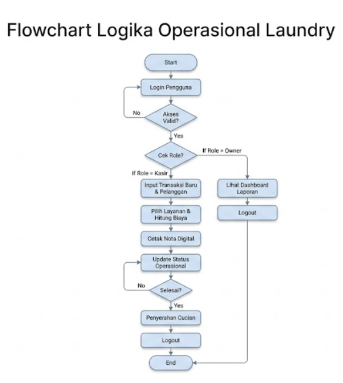

# **Modul 3**
## **1. Dasar Teori**
Flowchart atau diagram alir merupakan salah satu alat bantu dalam analisis dan perancangan sistem informasi yang digunakan untuk memodelkan alur proses secara terstruktur. Fungsi utama dari flowchart adalah memberi gambaran jalannya sebuah program dari satu proses ke proses lainnya. Fungsi lain dari flowchart adalah untuk menyederhanakan rangkaian prosedur agar memudahkan pemahaman terhadap informasi tersebut. Dalam perancangannya, flowchart menggunakan simbol-simbol standar yang telah ditetapkan untuk merepresentasikan proses, keputusan, input/output, dan terminator.
## **2. Flowchart Sistem Informasi Manajemen Laundry**
Flowchart ini dirancang untuk memodelkan proses operasional dan manajerial pada Sistem Informasi Manajemen Laundry berbasis web. Perancangan ini mengintegrasikan kontrol akses berbasis peran (*Role Based Access Control*) serta manajemen data terpusat menggunakan simbol standar internasional.

flowchart TD

`    `A([Start]) --> B[/Manual Input: Login/]

`    `B --> C{Autentikasi Valid?}

`    `C -- Tidak --> B

`    `C -- Ya --> D{Role Based Access Control}

`    `%% Jalur Admin/Kasir

`    `D -- Admin --> E[/Manual Input: Data Transaksi & Pelanggan/]

`    `E --> F[Processing: Kalkulasi Tarif & Validasi Diskon]

`    `F --> G[(Disk Storage: Simpan Data Transaksi)]

`    `G --> H[/Document: Cetak Nota Digital PDF/]

`    `H --> I[Processing: Update Progres Status Cucian]

`    `I --> J{Status Selesai?}

`    `J -- Belum --> I

`    `J -- Ya --> K[/Display: Notifikasi Pengambilan/]

`    `%% Jalur Owner

`    `D -- Owner --> L[/Display: Visualisasi Dashboard Harian/]

`    `L --> M[Processing: Rekapitulasi Pendapatan Cabang]

`    `M --> N[/Document: Cetak Laporan Keuangan Bulanan/]

`    `K --> O{Logout?}

`    `N --> O

`    `O -- Tidak --> D

`    `O -- Ya --> P([End])

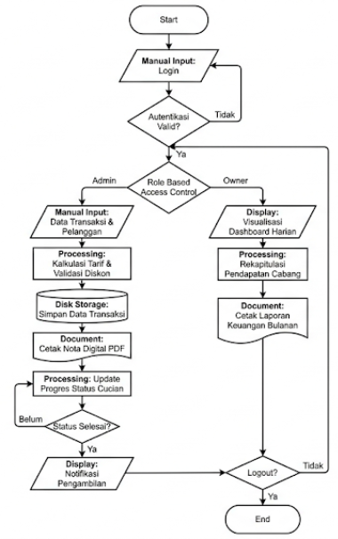
## **3. Tahapan Sistem Secara Berurutan**
Berikut adalah rincian tahapan sistem yang disusun secara sistematis berdasarkan alur logika di atas:

1. **Inisialisasi Sistem (Start)** Sistem dijalankan oleh pengguna melalui peramban web (browser).
1. **Autentikasi Pengguna (Login & Validasi)** Pengguna memasukkan kredensial secara manual. Sistem melakukan pengecekan pada basis data untuk memvalidasi identitas. Jika gagal, pengguna tetap berada pada halaman login.
1. **Role Based Access Control (RBAC)** Sistem melakukan pemilihan proses berdasarkan peran pengguna (Admin/Kasir atau Owner) untuk membatasi hak akses data.
1. **Proses Operasional Admin/Kasir:**
   1. **Input Data:** Mencatat detail cucian pelanggan secara manual on-line.
   1. **Kalkulasi & Validasi:** Sistem menghitung tarif secara otomatis termasuk promo tanpa perlu kalkulasi luar sistem.
   1. **Data Persistence:** Penyimpanan data ke dalam *Disk Storage* secara permanen untuk keamanan informasi.
   1. **Output Dokumentasi:** Menghasilkan nota digital sebagai bukti transaksi fisik yang sah.
   1. **Update Status:** Memantau alur operasional hingga pakaian siap dikembalikan.
1. **Proses Monitoring Owner:**
   1. **Visualisasi Data:** Menampilkan performa bisnis cabang pada layar monitor (*Display*).
   1. **Konsolidasi Data:** Sistem melakukan rekapitulasi otomatis data pendapatan dari berbagai cabang.
   1. **Laporan Manajemen:** Menghasilkan dokumen laporan keuangan periodik untuk arsip manajemen.
1. **Terminasi Sesi (Logout & End)** Sistem mengakhiri sesi pengguna dan membersihkan memori akses sebelum aplikasi benar-benar berhenti.

Dengan perancangan flowchart ini, alur logika sistem menjadi lebih terstruktur sehingga meminimalkan kesalahan implementasi pada tahap pengkodean.
# **Modul 4**
## **1. Dasar Teori**
Basis data merupakan kumpulan data yang saling berhubungan yang disimpan secara bersama tanpa redundansi yang tidak perlu agar dapat dimanfaatkan kembali dengan cepat dan mudah. Perancangannya dilakukan melalui siklus *Database Life Cycle* (DBLC) yang dimulai dari desain konseptual (ERD) untuk menjelaskan hubungan antar data, dilanjutkan dengan desain logik (CDM) untuk memvalidasi struktur, dan diakhiri dengan desain fisik (PDM) yang siap diimplementasikan ke dalam *Database Management System* (DBMS).
## **2. Hasil Analisis Desain Basis Data (ERD & CDM)**
Desain konseptual ini memodelkan seluruh objek informasi penting dalam ekosistem bisnis laundry. Struktur data yang dihasilkan meliputi:

- **Manajemen Akses (users):** Mengelola kredensial dan pembagian peran (*Owner*/*Admin*) untuk menjamin keamanan operasional.
- **Profil Pelanggan (pelanggan):** Menyimpan identitas dan kontak pelanggan sebagai basis data pemasaran dan operasional.
- **Katalog Layanan (layanan):** Master data tarif yang memudahkan manajemen dalam memperbarui harga layanan secara dinamis.
- **Pola Header-Detail (transaksi & detail\_transaksi):** Memisahkan data umum nota (tanggal, total, status) dengan rincian item cucian (berat, subtotal per jenis layanan). Hal ini memungkinkan satu nota memuat berbagai kategori layanan sekaligus.

**Kamus Data (Tabel Database):**

|**Nama Tabel**|**Atribut Utama**|**Tipe Data**|**Keterangan**|
| :- | :- | :- | :- |
|**users**|id\_user (PK)|int|Identifikasi unik pengguna sistem.|
||username|varchar||
||password|varchar||
||role|enum|Akses: 'Owner', 'Admin'.|
|**pelanggan**|id\_pelanggan (PK)|int|Identifikasi unik pelanggan.|
||nama\_pelanggan|varchar||
||nomor\_telepon|varchar||
||alamat|text||
|**layanan**|id\_layanan (PK)|int|Referensi layanan (master data).|
||nama\_layanan|varchar||
||harga\_per\_kg|decimal|Referensi harga per kilogram/pcs.|
|**transaksi**|id\_transaksi (PK)|int|**Header nota** penghubung petugas & pelanggan.|
||id\_user (FK)|int|Kasir yang menginput.|
||id\_pelanggan (FK)|int|Pelanggan pemilik cucian.|
||tanggal\_transaksi|datetime|Waktu nota dibuat.|
||total\_harga|decimal|Grand total pembayaran.|
||status\_cucian|enum|'Antre', 'Proses', 'Selesai', 'Diambil'.|
|**detail\_transaksi**|id\_detail (PK)|int|**Rincian item** dalam satu nota.|
||id\_transaksi (FK)|int|Menginduk ke nota mana.|
||id\_layanan (FK)|int|Jenis layanan yang dipilih.|
||berat|float|Berat dalam Kg / jumlah Pcs.|
||subtotal|decimal|Hasil kali berat \* harga\_per\_kg.|

**Gambar 4.1. ERD LMS (Laundry Management System)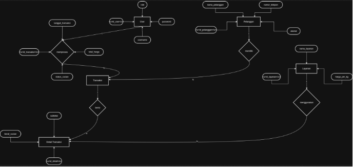**

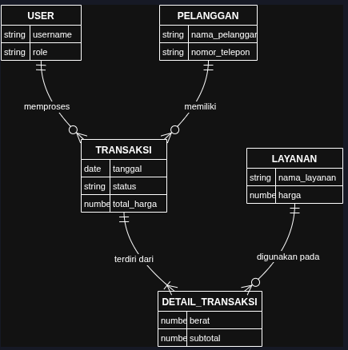

**Gambar 4.2. CDM LMS**
## **3. Implementasi Fisik (Physical Data Model)**
PDM yang dirancang telah menentukan spesifikasi teknis yang presisi untuk setiap tabel, memastikan efisiensi penyimpanan dan integritas relasi:

|**Tabel**|**Kolom Utama (PK/FK)**|**Tipe Data**|**Peran Data**|
| :-: | :-: | :-: | :-: |
|**users**|id\_user (PK)|int|Autentikasi dan identifikasi petugas.|
|**pelanggan**|id\_pelanggan (PK)|int|Identifikasi unik pelanggan.|
|**layanan**|id\_layanan (PK)|int|Referensi harga per kilogram.|
|**transaksi**|id\_transaksi (PK), id\_user (FK), id\_pelanggan (FK)|int, datetime, decimal|Header nota yang menghubungkan petugas dan pelanggan.|
|**detail\_transaksi**|id\_detail (PK), id\_transaksi (FK), id\_layanan (FK)|int, float, decimal|Rincian item yang menghubungkan nota dengan jenis layanan.|

|
erDiagram

`    `users {

`        `int id\_user PK

`        `varchar username

`        `varchar password

`        `enum role "Owner, Admin"

`    `}

`    `pelanggan {

`        `int id\_pelanggan PK

`        `varchar nama\_pelanggan

`        `varchar nomor\_telepon

`        `text alamat

`    `}

`    `layanan {

`        `int id\_layanan PK

`        `varchar nama\_layanan

`        `decimal harga\_per\_kg

`    `}

`    `transaksi {

`        `int id\_transaksi PK

`        `int id\_user FK

`        `int id\_pelanggan FK

`        `datetime tanggal\_transaksi

`        `decimal total\_harga

`        `enum status\_cucian "Antre, Proses, Selesai, Diambil"

`    `}

`    `detail\_transaksi {

`        `int id\_detail PK

`        `int id\_transaksi FK

`        `int id\_layanan FK

`        `float berat

`        `decimal subtotal

`    `}

`    `users ||--o{ transaksi : "id\_user"

`    `pelanggan ||--o{ transaksi : "id\_pelanggan"

`    `transaksi ||--|{ detail\_transaksi : "id\_transaksi"

`    `layanan ||--o{ detail\_transaksi : "id\_layanan"
|
| :- |

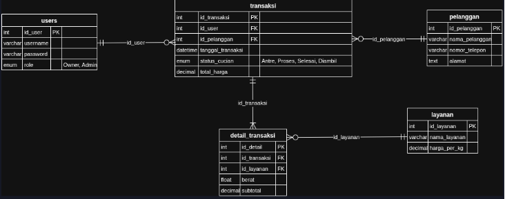

**Gambar 4.3. PDM LMS**

## **4. Kesimpulan**
Rancangan ERD, CDM, dan PDM ini telah memenuhi standar normalisasi data yang baik. Pemisahan antara header dan detail transaksi menjamin sistem dapat menghasilkan laporan pendapatan yang sangat detail (per layanan, per petugas, atau per pelanggan) dengan risiko redundansi yang minimal. Struktur ini memberikan fondasi yang sangat kuat bagi pengembang untuk melanjutkan ke tahap *coding* database menggunakan SQL.
# **Modul 5**
## **1. Dasar Teori**
Data Flow Diagram (DFD) merupakan alat bantu dalam perancangan sistem terstruktur yang menggambarkan arus data dalam sistem secara logis tanpa mempertimbangkan lingkungan fisik. Melalui pendekatan terstruktur, DFD memungkinkan pengembang untuk memecah sistem yang kompleks menjadi bagian-bagian yang lebih kecil melalui teknik dekomposisi. Komponen utama DFD meliputi entitas eksternal (terminator), proses yang mentransformasikan input menjadi output, aliran data (data flow), dan penyimpanan data (data store). Penggunaan DFD memastikan bahwa seluruh kebutuhan informasi sistem terdefinisikan dengan jelas, mulai dari level teratas (Diagram Konteks) hingga level yang lebih rinci.
## **2. Diagram Konteks (Level 0)**
Diagram konteks menggambarkan ruang lingkup sistem secara global serta interaksi antara sistem dengan entitas luar (Pelanggan, Kasir/Admin, dan Owner).

|
graph LR

`    `P((0. Sistem Informasi   Manajemen Laundry))

    

`    `E1[Pelanggan]

`    `E2[Kasir / Admin]

`    `E3[Owner]

`    `%% Aliran Pelanggan

`    `E1 -- Data Pelanggan --> P

`    `P -- Struk Nota Digital --> E1

`    `%% Aliran Kasir

`    `E2 -- Data Login --> P

`    `E2 -- Data Transaksi & Item --> P

`    `E2 -- Update Status Cucian --> P

`    `P -- Info Validasi & Status --> E2

`    `%% Aliran Owner

`    `E3 -- Data Login --> P

`    `E3 -- Update Harga/Layanan --> P

`    `P -- Laporan Pendapatan --> E3

`    `P -- Rekap Data Transaksi --> E3

|
| :- |

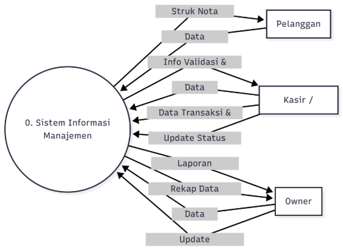

**Gambar 5.1** Diagram Konteks Sistem Informasi Manajemen Laundry
## **3. Diagram Dekomposisi**
Diagram ini menunjukkan hierarki proses fungsional yang ada di dalam sistem laundry.

|
graph TD

`    `P0[Sistem Informasi Manajemen Laundry]

    

`    `P1[1.0 Manajemen Akun]

`    `P2[2.0 Olah Data Master]

`    `P3[3.0 Operasional Transaksi]

`    `P4[4.0 Pembuatan Laporan]

`    `P0 --> P1

`    `P0 --> P2

`    `P0 --> P3

`    `P0 --> P4

`    `P3 --> P3.1[3.1 Input Header Transaksi]

`    `P3 --> P3.2[3.2 Input Detail Item & Berat]

`    `P3 --> P3.3[3.3 Update Status Cucian]

    

`    `P4 --> P4.1[4.1 Rekap Harian]

`    `P4 --> P4.2[4.2 Laporan per Cabang]

|
| :- |

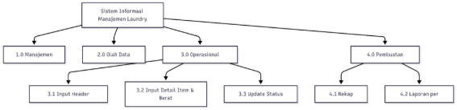

**Gambar 5.2** Diagram Dekomposisi Fungsional Sistem Manajemen Laundry
## **4. DFD Level 0 (Overview Diagram)**
DFD Level 0 menguraikan aliran data ke dalam proses-proses utama serta interaksinya dengan *Data Store* yang telah dirancang di modul sebelumnya.

|
flowchart TD

`    `%% Entitas

`    `Admin[Kasir / Admin]

`    `Owner[Owner]

`    `Cust[Pelanggan]

`    `%% Proses

`    `P1((1.0   Login &   Autentikasi))

`    `P2((2.0   Olah Data   Master))

`    `P3((3.0   Transaksi   Operasional))

`    `P4((4.0   Pembuatan   Laporan))

`    `%% Data Store

`    `D1[(D1. users)]

`    `D2[(D2. pelanggan)]

`    `D3[(D3. layanan)]

`    `D4[(D4. transaksi)]

`    `D5[(D5. detail\_transaksi)]

`    `%% Aliran Data Proses 1

`    `Admin -- Data Login --> P1

`    `Owner -- Data Login --> P1

`    `P1 -- Validasi Akun --> D1

`    `D1 -- Info Role --> P1

`    `P1 -- Akses Menu --> Admin

`    `P1 -- Akses Menu --> Owner

`    `%% Aliran Data Proses 2

`    `Admin -- Input Pelanggan --> P2

`    `Owner -- Update Harga --> P2

`    `P2 -- Simpan Data --> D2

`    `P2 -- Simpan Layanan --> D3

`    `%% Aliran Data Proses 3

`    `Admin -- Data Cucian & Berat --> P3

`    `P3 -- Cek Harga --> D3

`    `P3 -- Simpan Header --> D4

`    `P3 -- Simpan Detail --> D5

`    `P3 -- Struk --> Cust

`    `Admin -- Update Progres --> P3

`    `P3 -- Update Status --> D4

`    `%% Aliran Data Proses 4

`    `D4 -- Data Pendapatan --> P4

`    `D5 -- Data Item Layanan --> P4

`    `P4 -- Laporan Evaluasi --> Owner

|
| :- |

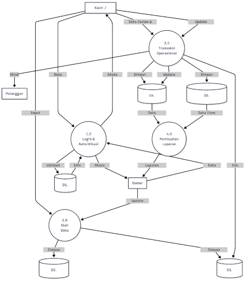

**Gambar 5.3** Data Flow Diagram (DFD) Level 0 Sistem Manajemen Laundry
## **5. DFD Level 1 (Proses 3.0: Operasional Transaksi)**
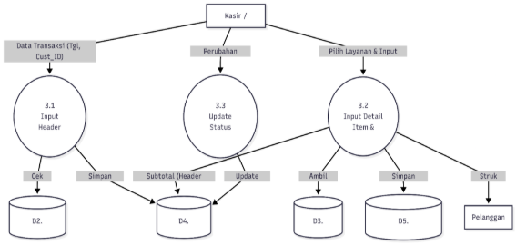

**Gambar 5.4** Data Flow Diagram (DFD) Level 1 Proses 3.0 Operasional Transaksi

Menjelaskan secara detail proses pencatatan nota laundry menggunakan pola *Header-Detail*.

1. **3.1 Input Header Transaksi:** Mengidentifikasi pelanggan dan mencatat waktu masuk cucian ke tabel transaksi.
1. **3.2 Input Detail Item:** Menghitung tarif per item berdasarkan berat dan jenis layanan, lalu disimpan ke tabel detail\_transaksi.
1. **3.3 Update Status Cucian:** Mengubah status dari Antre, Proses, Selesai, hingga Diambil.
## **6. Kesimpulan**
Melalui perancangan Data Flow Diagram ini, alur data pada Sistem Informasi Manajemen Laundry telah terpetakan secara terstruktur. Penggunaan pola *Header-Detail* yang sebelumnya dirancang pada ERD/PDM kini terimplementasi secara fungsional melalui pemisahan aliran data pada Proses 3.0. DFD ini menjamin bahwa seluruh transformasi data, mulai dari input manual kasir hingga menjadi informasi laporan bagi Owner, berjalan secara logis dan meminimalkan risiko kehilangan data.

# **
# **Modul 6**
## **1. Dasar Teori**
Unified Modelling Language (UML) adalah bahasa standar untuk visualisasi, spesifikasi, perancangan, dan pendokumentasian struktur perangkat lunak, khususnya pada sistem berorientasi objek. Salah satu diagram utama dalam UML adalah *Use Case Diagram*. Diagram ini menggambarkan interaksi antara aktor (pengguna atau sistem lain) dengan sistem informasi yang dibangun. *Use Case* berfungsi untuk memodelkan persyaratan fungsional sistem dari sudut pandang pengguna, mendefinisikan siapa saja aktor yang terlibat, serta aktivitas apa saja yang dapat mereka lakukan di dalam sistem.
## **2. Identifikasi Aktor dan Use Case**
Berdasarkan analisis pada modul sebelumnya, sistem ini melibatkan dua aktor utama dan satu aktor pasif dengan peran sebagai berikut:
### **2.1. Daftar Aktor**
1. **Admin / Kasir:** Bertanggung jawab atas operasional harian, mulai dari pendaftaran pelanggan, pencatatan transaksi, hingga memperbarui status cucian.
1. **Owner:** Memiliki otoritas manajerial untuk mengatur data master (layanan dan harga) serta memantau performa bisnis melalui laporan.
1. **Pelanggan (Aktor Pasif):** Pihak yang datanya diregistrasi dan menerima output berupa nota/struk digital.
### **2.2. Daftar Use Case**
- **Login:** Proses autentikasi masuk ke sistem.
- **Registrasi Pelanggan:** Mengelola data identitas pelanggan baru.
- **Kelola Data Layanan & Harga:** Mengatur katalog paket laundry (khusus Owner).
- **Transaksi Laundry:** Proses penginputan item cucian dan berat.
- **Cetak Nota:** Menghasilkan struk fisik/digital sebagai bukti transaksi.
- **Update Status Cucian:** Memperbarui progres (Antre/Proses/Selesai).
- **Lihat Laporan Pendapatan:** Memantau rekapitulasi keuangan (khusus Owner).
- **Logout:** Mengakhiri sesi akses sistem.
## **3. Use Case Diagram**
Diagram di bawah ini memvisualisasikan hubungan antara aktor dan fungsionalitas sistem informasi laundry.

|
graph LR

`    `subgraph Sistem\_Laundry [Sistem Informasi Manajemen Laundry]

`        `UC1(Login)

`        `UC2(Registrasi Pelanggan)

`        `UC3(Transaksi Laundry)

`        `UC4(Cetak Nota)

`        `UC5(Update Status Cucian)

`        `UC6(Kelola Master Layanan)

`        `UC7(Lihat Laporan Pendapatan)

`        `UC8(Logout)

`        `UC9(Validasi Akun)

`    `end

`    `%% Hubungan Aktor dengan Use Case

`    `Admin((Admin / Kasir)) --- UC1

`    `Admin --- UC2

`    `Admin --- UC3

`    `Admin --- UC5

`    `Admin --- UC8

`    `Owner((Owner)) --- UC1

`    `Owner --- UC6

`    `Owner --- UC7

`    `Owner --- UC8

`    `%% Relasi Include

`    `UC1 -.->|<< include >>| UC9

`    `UC3 -.->|<< include >>| UC4

`    `%% Styling

`    `style UC1 fill:#f9f,stroke:#333

`    `style UC3 fill:#bbf,stroke:#333

`    `style UC7 fill:#bfb,stroke:#333
|
| :- |

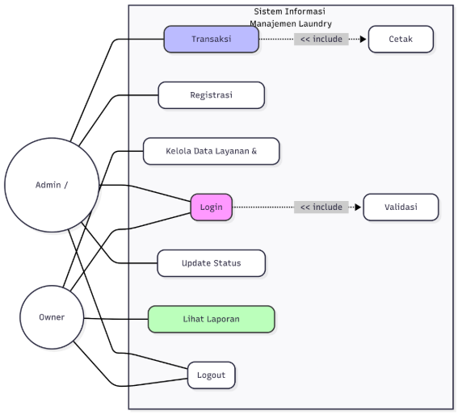

**Gambar 6.1** Use Case Diagram Sistem Informasi Manajemen Laundry
## **4. Penjelasan Rinci Tahapan Use Case**
Berikut adalah penjelasan fungsional dari setiap interaksi pada diagram di atas:

1. **Login & Validasi Akun (include):** Baik Admin maupun Owner harus melakukan login. Sistem secara otomatis melakukan *include* validasi akun ke basis data untuk memastikan kredensial dan hak akses (*Role*) sudah sesuai.
1. **Registrasi Pelanggan:** Admin memasukkan data pelanggan ke dalam sistem. Hal ini berkaitan dengan *Data Store* pelanggan pada perancangan sebelumnya.
1. **Kelola Data Layanan & Harga:** Use case ini eksklusif bagi Owner untuk memastikan standarisasi harga di toko utama maupun cabang kecil tetap terjaga.
1. **Transaksi Laundry & Cetak Nota (include):** Saat Admin memproses transaksi laundry (mengisi berat dan layanan), sistem secara otomatis mencetak nota sebagai bukti yang sah bagi pelanggan.
1. **Update Status Cucian:** Admin memantau alur operasional. Perubahan status di sini akan mempengaruhi data yang ditampilkan pada dashboard monitoring Owner.
1. **Lihat Laporan Pendapatan:** Owner mengakses menu laporan untuk melihat rekapitulasi transaksi harian atau bulanan guna pengambilan keputusan bisnis.
1. **Logout:** Aktor keluar dari sistem untuk menjaga keamanan data operasional.
## **5. Kesimpulan**
Perancangan *Use Case Diagram* ini telah menyinkronkan interaksi aktor dengan alur data yang telah didefinisikan pada DFD. Dengan adanya pemisahan peran yang jelas antara Admin dan Owner, serta penggunaan relasi *include* pada proses login dan transaksi, sistem ini memiliki batasan akses yang kuat serta alur kerja operasional yang sistematis. Hal ini akan mempermudah tahap selanjutnya dalam perancangan struktur kelas (*Class Diagram*).

# **
# **Modul 7**
## **1. Dasar Teori**
Class Diagram atau diagram kelas adalah satu jenis dari Structure Diagrams yang ada pada UML (Unified Modelling Language). Class Diagram digunakan untuk menggambarkan struktur sistem dari segi pendefinisian kelas-kelas yang akan dibuat untuk membangun sistem. Class Diagram bersifat statis, dalam artian diagram kelas bukan menjelaskan apa yang terjadi jika kelas-kelasnya berhubungan, melainkan menjelaskan hubungan apa yang terjadi.

Susunan struktur class yang baik pada Class Diagram memiliki jenis-jenis kelas sebagai berikut:

1. **Kelas Main:** Kelas yang memiliki fungsi awal dieksekusi ketika sistem dijalankan.
1. **Kelas View:** Kelas yang mendefinisikan dan mengatur tampilan ke pengguna.
1. **Kelas Controller:** Kelas yang menangani fungsi-fungsi (proses bisnis) pada perangkat lunak.
1. **Kelas Model:** Kelas yang digunakan untuk memegang atau membungkus data (Entity) yang diambil maupun disimpan pada basis data.
## **2. Analisis Struktur Kelas (MVC Pattern)**
Berdasarkan analisis kebutuhan fungsional dan teknis pada modul-modul sebelumnya, berikut adalah pembagian kelas untuk Sistem Informasi Manajemen Laundry:
### **2.1. Model Class (Entity)**
Mewakili struktur data yang ada pada basis data (PDM):

- **User:** Menyimpan kredensial dan peran (Admin/Owner).
- **Pelanggan:** Menyimpan profil pelanggan.
- **Layanan:** Menyimpan katalog paket laundry.
- **Transaksi:** Sebagai header nota laundry.
- **DetailTransaksi:** Sebagai rincian item cucian (Pola Header-Detail).
### **2.2. Controller Class (Logic)**
Menangani proses bisnis utama:

- **AuthController:** Menangani validasi login dan manajemen sesi.
- **TransactionController:** Menangani logika perhitungan biaya, promo ulang tahun, dan update status.
- **ReportController:** Menangani penarikan data untuk laporan Owner.
### **2.3. View Class (UI)**
Mengatur antarmuka pengguna:

- **LoginView:** Tampilan autentikasi.
- **DashboardView:** Tampilan utama (Admin/Owner).
- **TransactionView:** Form input cucian dan update status.
## **3. Class Diagram Sistem Informasi Manajemen Laundry**

|
classDiagram

`    `class App {

`        `+main()

`    `}

`    `class LoginView {

`        `+showLogin()

`        `+displayError()

`    `}

`    `class TransactionView {

`        `+showFormTransaksi()

`        `+displayInvoice()

`        `+updateStatusUI()

`    `}

`    `class AuthController {

`        `-currentUser: User

`        `+login(username, password)

`        `+logout()

`        `+checkRole()

`    `}

`    `class TransactionController {

`        `+createTransaksi()

`        `+addDetailItem()

`        `+calculateTotal()

`        `+applyPromoBirthday()

`        `+updateStatus(id\_transaksi)

`    `}

`    `class User {

`        `-id\_user: int

`        `-username: string

`        `-password\_hash: string

`        `-role: string

`        `+getIdUser()

`        `+getRole()

`    `}

`    `class Pelanggan {

`        `-id\_pelanggan: int

`        `-nama: string

`        `-telepon: string

`        `-tgl\_lahir: date

`        `+getTglLahir()

`    `}

`    `class Layanan {

`        `-id\_layanan: int

`        `-nama\_layanan: string

`        `-harga\_per\_kg: decimal

`    `}

`    `class Transaksi {

`        `-id\_transaksi: int

`        `-tgl\_masuk: datetime

`        `-total\_harga: decimal

`        `-status: string

`        `+setTotal()

`        `+setStatus()

`    `}

`    `class DetailTransaksi {

`        `-id\_detail: int

`        `-berat: float

`        `-subtotal: decimal

`    `}

`    `%% Relationships

`    `App ..> AuthController : "initializes"

`    `LoginView ..> AuthController : "uses"

`    `TransactionView ..> TransactionController : "uses"

    

`    `AuthController --> User : "manages"

`    `TransactionController --> Transaksi : "processes"

`    `TransactionController --> Pelanggan : "validates"

    

`    `User "1" -- "0..\*" Transaksi : "records"

`    `Pelanggan "1" -- "0..\*" Transaksi : "makes"

`    `Transaksi "1" \*-- "1..\*" DetailTransaksi : "contains (composition)"

`    `Layanan "1" -- "0..\*" DetailTransaksi : "referred by"
|
| :- |
##
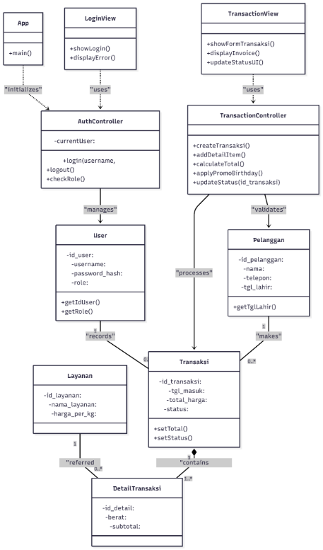
## **4. Deskripsi Relasi dan Multiplisitas**
1. **Asosiasi (User ke Transaksi):** Satu User (Kasir) dapat memproses banyak objek Transaksi (1..\*), namun satu Transaksi hanya dicatat oleh satu User.
1. **Komposisi (Transaksi ke DetailTransaksi):** Hubungan ini menggunakan agregasi kuat/komposisi. Jika objek Transaksi dihapus, maka objek DetailTransaksi yang terkait dengannya juga akan hilang. Satu Transaksi harus memiliki minimal satu atau lebih DetailTransaksi (1..\*).
1. **Asosiasi (Pelanggan ke Transaksi):** Satu Pelanggan dapat melakukan banyak Transaksi (0..\*), yang memungkinkan pelacakan riwayat cucian secara akurat.
1. **Dependency (View ke Controller):** Kelas View bergantung pada Controller untuk memproses data. Misalnya, TransactionView memanggil metode di TransactionController untuk menghitung total biaya secara otomatis.
## **5. Kesimpulan**
Perancangan Class Diagram ini telah menyinkronkan seluruh artefak perancangan sebelumnya (ERD dan Use Case) ke dalam struktur kelas yang statis. Penggunaan pola Header-Detail yang direpresentasikan melalui relasi antara Transaksi dan DetailTransaksi menjamin fleksibilitas sistem dalam menangani operasional laundry. Struktur ini memberikan panduan teknis yang jelas bagi programmer untuk mengimplementasikan kode program secara konsisten sesuai dengan kebutuhan bisnis yang telah dianalisis.
# **
# **Modul 8**
## **1. Dasar Teori**
Sequence diagram menggambarkan interaksi antar objek di dalam dan disekitar sistem (termasuk pengguna, display, dan sebagainya) berupa message yang digambarkan terhadap waktu. Sequence diagram terdiri antara dimensi vertikal (waktu) dan dimensi horizontal (objek-objek yang terkait). Sequence diagram biasa digunakan untuk menggambarkan skenario atau rangkaian langkah-langkah yang dilakukan sebagai respons dari sebuah event untuk menghasilkan output tertentu.

Dalam pengembangannya, kelas-kelas diidentifikasi berdasarkan jenisnya:

1. **Boundary Class:** Kelas yang menghubungkan user dengan sistem aplikasi (User Interface).
1. **Control Class:** Kelas yang mengkoordinasi atau mengendalikan aktivitas dalam sistem (Logic).
1. **Entity Class:** Kelas yang berhubungan dengan data atau informasi yang digunakan oleh sistem (Database).
## **2. Skenario Sequence Diagram**
Berikut adalah perancangan Sequence Diagram untuk skenario utama pada Sistem Informasi Manajemen Laundry:
### **2.1. Skenario 1: Login Pengguna (Admin/Owner)**
Skenario ini menggambarkan proses autentikasi aktor saat masuk ke dalam sistem.

|
sequenceDiagram

`    `actor User as Aktor (Admin/Owner)

`    `participant LV as LoginView (Boundary)

`    `participant AC as AuthController (Control)

`    `participant U as User (Entity)

`    `User->>LV: Input Username & Password

`    `LV->>AC: login(username, password)

`    `AC->>U: findUser(username)

`    `U-->>AC: userData

    

`    `alt Kredensial Valid

`        `AC->>AC: checkPassword()

`        `AC-->>LV: loginSuccess()

`        `LV-->>User: Tampilkan Dashboard

`    `else Kredensial Tidak Valid

`        `AC-->>LV: loginFailed()

`        `LV-->>User: Tampilkan Pesan Error

`    `end
|
| :- |

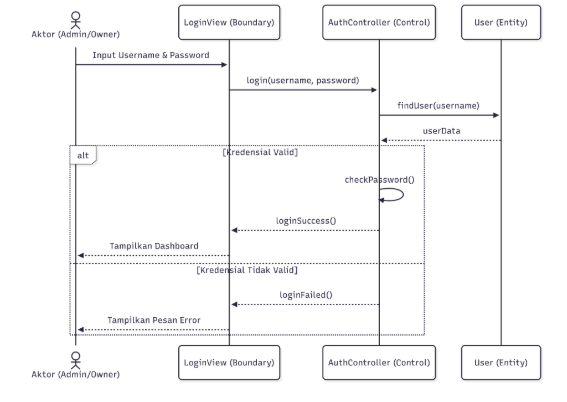
### **2.2. Skenario 2: Transaksi Laundry (Header-Detail)**
Skenario ini merinci proses input transaksi yang melibatkan perhitungan tarif otomatis dan penyimpanan data ke tabel *header* dan *detail*.

|
sequenceDiagram

`    `actor Admin as Admin/Kasir

`    `participant TV as TransactionView (Boundary)

`    `participant TC as TransactionController (Control)

`    `participant T as Transaksi (Entity)

`    `participant DT as DetailTransaksi (Entity)

`    `participant L as Layanan (Entity)

`    `Admin->>TV: Input Data Pelanggan & Tgl

`    `TV->>TC: createTransaksi(id\_pelanggan)

`    `TC->>T: saveHeader()

    

`    `loop Tambah Item Cucian

`        `Admin->>TV: Input Layanan & Berat

`        `TV->>TC: addDetail(id\_layanan, berat)

`        `TC->>L: getHarga()

`        `L-->>TC: tarif

`        `TC->>TC: calculateSubtotal()

`        `TC->>DT: saveDetail()

`    `end

    

`    `TC->>TC: calculateTotal()

`    `TC->>TC: checkPromoBirthday()

`    `TC->>T: updateTotalPrice()

`    `TC-->>TV: transactionSaved()

`    `TV-->>Admin: Cetak Nota (Invoice)

|
| :- |

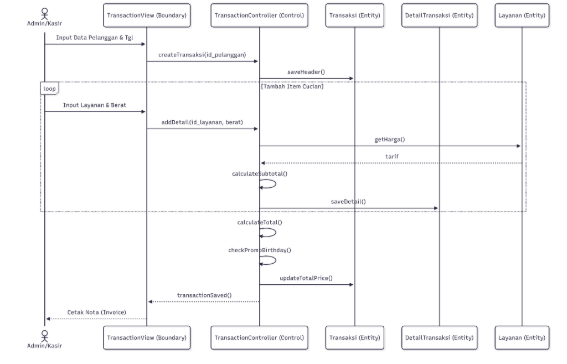
### **2.3. Skenario 3: Update Status Cucian**
Admin melakukan pembaruan status progres cucian agar bisa dipantau oleh sistem.

|
sequenceDiagram

`    `actor Admin as Admin/Kasir

`    `participant TV as TransactionView (Boundary)

`    `participant TC as TransactionController (Control)

`    `participant T as Transaksi (Entity)

`    `Admin->>TV: Pilih Transaksi & Update Status

`    `TV->>TC: updateStatus(id\_transaksi, status baru)

`    `TC->>T: setStatus()

`    `T-->>TC: success

`    `TC-->>TV: statusUpdated()

`    `TV-->>Admin: Tampilkan Status Baru

|
| :- |

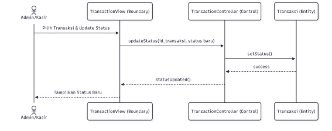

### **2.4. Skenario 4: Lihat Laporan Pendapatan (Owner)**
Owner mengakses dashboard untuk melihat rekapitulasi keuangan dari data transaksi.

|
sequenceDiagram

`    `actor Owner as Owner

`    `participant DV as DashboardView (Boundary)

`    `participant RC as ReportController (Control)

`    `participant T as Transaksi (Entity)

`    `Owner->>DV: Klik Menu Laporan

`    `DV->>RC: getReportData(periode)

`    `RC->>T: fetchAllTransactions()

`    `T-->>RC: listData

`    `RC->>RC: summarizeRevenue()

`    `RC-->>DV: displayReport(data)

`    `DV-->>Owner: Tampilkan Grafik Pendapatan
|
| :- |

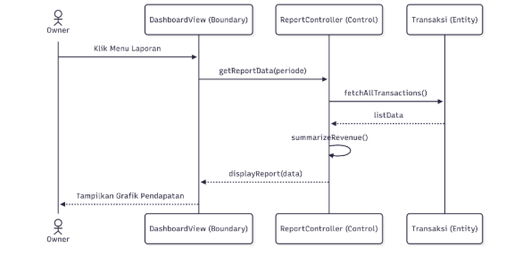
## **3. Penjelasan Rinci Interaksi Objek**
1. **Dimensi Waktu:** Setiap pesan (*message*) dikirim secara berurutan dari atas ke bawah, menunjukkan urutan eksekusi pada *runtime*.
1. **Fragmen alt:** Digunakan pada skenario Login untuk menangani dua kondisi berbeda (sukses atau gagal) berdasarkan validasi data.
1. **Fragmen loop:** Digunakan pada skenario Transaksi untuk memungkinkan Admin memasukkan banyak item (Kiloan, Bedcover, dll) dalam satu nomor nota transaksi tunggal, sesuai dengan pola *Header-Detail*.
1. **Relasi Objek:** TransactionController bertindak sebagai otak yang mengoordinasikan data antara tampilan (View) dengan penyimpanan (Entity).
## **4. Kesimpulan**
Perancangan *Sequence Diagram* ini telah berhasil memodelkan perilaku dinamis sistem laundry secara mendalam. Dengan menggambarkan interaksi antar objek terhadap waktu, skenario-skenario kritis seperti transaksi dan laporan keuangan kini memiliki alur logika yang jelas. Hal ini memastikan bahwa fungsionalitas yang telah dirancang pada modul-modul sebelumnya (Use Case dan Class Diagram) dapat diimplementasikan dengan tepat oleh pengembang pada tahap pengkodean nantinya.

# **Modul 9**
# **
# **Modul 10**
